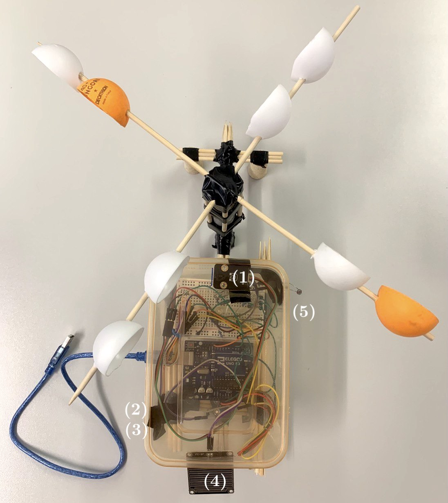
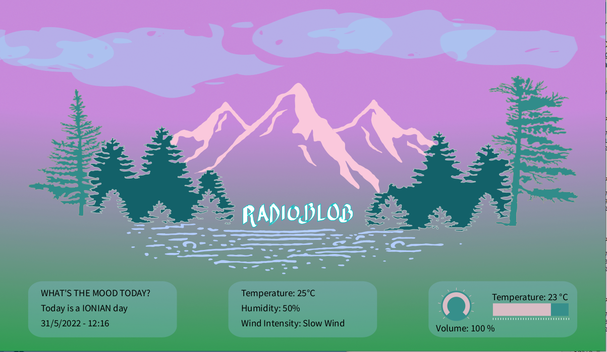
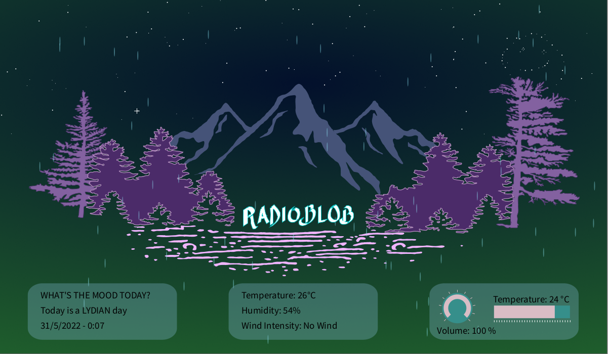

# RadioBlob

<em> Group 10 - AKGigi </em>

  

## General informations
RadioBlob is a complete Computer Music System (CMS) with interaction design principles implemented by means of Arduino (used as interaction system unit and control device), SuperCollider (used as computer music unit and provider of OSC messages) and Processing (used as graphical feedback unit).
 
RadioBlob is a DIY weather station that processes climate data into audio signals. In particular, the music that is generated and played in SuperCollider is based on the data that are processed by the station and is different for each weather condition. Similarly, the graphical feedback unit implemented in Processing behaves differently depending on the weather conditions.

    

In the Figure we present how the weather station was constructed and assembled.
The plastic case contains all the electronic equipment: the magnetic sensor - use to compute the wind speed, more information in the report - (1), the temperature and humidity sensors (2, 3), the rain detector (4), the light sensor (5), the Arduino board and the rest of the circuit.
___

## Folder structure

In the GitHub repository you will find the SuperCollider file (ambient.scd) and the following folders: 

- Arduino, containing the .ino file (RadioBlob.ino).
- Processing, which includes the classes, the main program and the images folder used in the main.
- samples, which contains the samples used in SuperCollider.

___

## Processing and GUI

The graphical unit interface created in Processing allows the visualization of the weather parameters it receives as OSC messages from SuperCollider. 
In the project we use different external libraries, mandatory to implement the following features: the communication between Processing and SuperCollider (netP5 and oscP5), the interactive objects (a volume knob and a slider) with the controlP5 library, the first one controls the output volume, while the slider allows the user to set their ideal external temperature - more information in the report.

    

In the two shown figures it's possible to appreciate the Processing graphical unit interface for two particular climate conditions. 
- First image: slow wind make the trees oscillate and brightness (measured with the light sensor) makes the clouds move and modifies the background brightness. 
- Second image: water drops are visible in rainy days, during the night the stars shine.

    

___

## Notes
The Arduino board sends the data via USB. A better implementation of the weather station should have an Arduino board with a Wifi module, more appropriate to send data for this kind of applications.

 
Sensor used to measure

- Temperature and Humidity: DHT11 by AZDelivery. This sensor acquires both temperature (in Celsius degrees) and humidity (in percentage) exploiting a proprietary protocol and a dedicated library that allows the access to these quantities through a digital input of the board.
- Rain: Rain Sensor by AZDelivery. We want to specify that we decided to exclude the digital input, since the analog one is already a good indicator of the rain's behaviour, giving also an accurate feedback of the magnitude of this phenomenon.
- Light: a photoresistor. As for the previous sensor, an analog input has been used to read the values of light detected in real time.
- Wind speed:  magnetic Sensor and the DIY windmill.

___

## Group Components

- Riccardo Alfieri (riccardo.alfieri@mail.polimi.it)
- Riccardo Iaccarino (riccardo.iaccarino@mail.polimi.it)
- Manuele Montrasio (manuele.montrasio@mail.polimi.it)
- Silvio Sgotto (silvio.sgotto@mail.polimi.it)
- Francesco Veronesi (francesco2.veronesi@mail.polimi.it)
